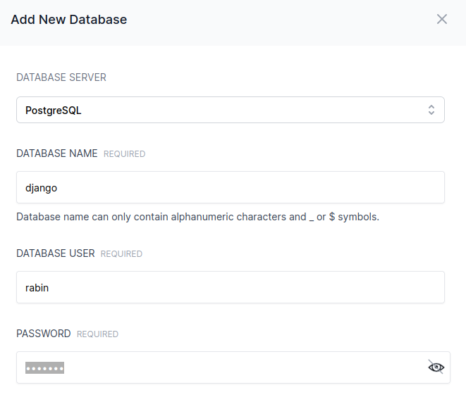
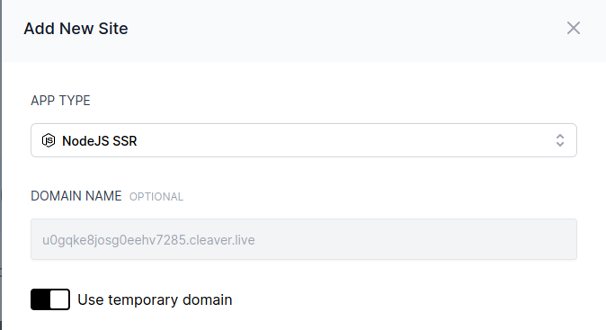
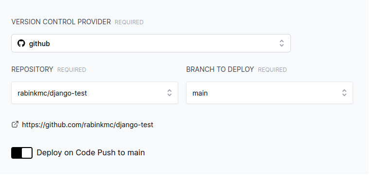
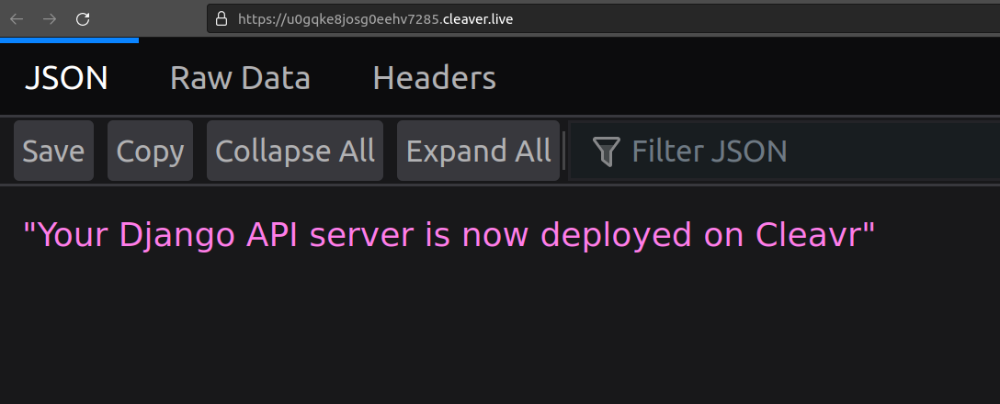

# Deploying Django(DRF) api server with Postgres using PM2

## Prerequisites
Before proceeding, you need to have a cleavr account and provision a server with Postgres (or any other database server supported by Django).


## Add Postgres database

If you haven't added your server during provisioning: 

To add a postgres database: go to Servers > Databases > Add new Database 



## Add a NodeJs SSR site



## Add your github repository 

For this project, I am deploying a simple [django-test](https://github.com/rabinkmc/django-test) project



## Configure your environment settings

```
SECRET_KEY='lkjshdlkjhsdf788fgkjsdfg8s9d8fg7s0d8fgsdfhgsdf87gs0f78dgs08f7dg6'
ENVIRONMENT='production'
DEBUG=False
ALLOWED_HOSTS=['127.0.0.1','localhost','u0gqke8josg0eehv7285.cleaver.live']
DATABASE_NAME='django'
DATABASE_USER='rabin'
DATABASE_PASSWORD='test123'
DATABASE_HOST='localhost'
```

## configure your build settings

```json
module.exports = {
  name: "u0gqke8josg0eehv7285.cleaver.live",
  script: "manage.py",
  args: "runserver 9588",
  log_type: "json",
  cwd: "/home/cleavr/u0gqke8josg0eehv7285.cleaver.live/current",
  interpreter : "/usr/bin/python3",
  env: {
    "PORT": 9588,
    "CI": 1,
    "NUXT_TELEMETRY_DISABLED": 1
  }
}
```

## Add deployment hooks

1. add install requirements hook 
```
pip install -r requirements.txt
```

2. add database migration hook 
```
python manage.py migrate
```

3. disable **install npm packages**
4. disable **build assets**


## Once, everything is configured, Click on Deploy 

Your api server will be deployed on the site.

